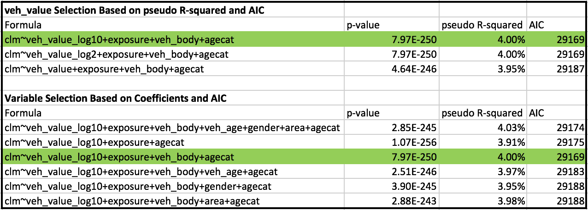

```{r, , echo=FALSE, message=FALSE, warning=FALSE}
library(dplyr)
library(ggplot2)
library(ROCR)
library(grid)
library(scales)


## laod data
dataCar = read.csv('dataCar.csv',header=TRUE)
dataCar1 = dataCar %>% select(X, veh_value, exposure, clm, veh_body, veh_age, gender, area, agecat)
dataCar1$clm = as.factor(dataCar1$clm)
dataCar2 = dataCar1[dataCar1$veh_value != 0,]

## print multiple plots 
multi_plot <- function(plist) {
  n <- length(plist)
  grid.newpage()
  pushViewport(viewport(layout=grid.layout(n,1)))
  vplayout=function(x,y) {viewport(layout.pos.row=x, layout.pos.col=y)} 
  for(i in 1:n) {
    print(plist[[i]], vp=vplayout(i,1))
  }
}
```

# Objective
The objective of this project is to identify auto insurance buyers who have a higher risk of submitting a claim within the first year of a policy based on the information available at the time of purchase. This information can then be used as a tool when determining the appropriate premium to charge the buyer in order to lower cost for the company. Insurance policy data from 2004 & 2005 accessibile via the [dataCar](https://www.rdocumentation.org/packages/insuranceData/versions/1.0/topics/dataCar) dataset is available for this project.

# Data Exploration and Insights

The goal is to create an effective model to predict the probability a vehicle will submit at least one claim in the first year of the policy. To achieve this we must first ensure that the policy characteristics (referred to as features) being utilized are available at that time of purchase, are accurate and help predict the likelihood of a claim submission. As a result: 

1. Only the data available before the policy is taken out can be utilized. Therefore, the number of claims submitted and the amount of the claim will not be considered.

2. Data that has no predictive power can be removed. Since the X_OBSTAT_ feature has the same value for all policies, it can be ignored.

3. Data that is inaccurate should be transformed or removed. 53 policies have a vehicle value of $0.00 which is inaccurate and can have a negative impact on the predictions. If the other properties for these polices appear to be valid, the vehicle value can be adjusted to the mean for these data points. However, since the exposure for these 53 policies also appear to be inflated compared to the population, these polices may be invalid. For this reason and because they only represent a very small portion of the population, they will be removed. 

```{r, , echo=FALSE, message=FALSE, warning=FALSE}
no_veh_value = dataCar[dataCar$veh_value == 0,]
no_veh_value_exp = sum(no_veh_value$exposure > .99) / nrow(no_veh_value)
pop_exp = sum(dataCar$exposure > .99) / nrow(dataCar)

cat('Percent of $0.00 vehicle value polices with exposure > 0.99: ', sprintf('%.2f', no_veh_value_exp * 100), '%', sep='')
cat('Percent of population with exposure > 0.99: ', sprintf('%.2f', pop_exp * 100), '%', sep='')
```

It is also important to examine the features to determine if there are any obvious relationship to the outcome trying to be predicted. The best way to accomplish this is to look at the proportion of policies that submit claims for each feature. 

1. There is a clear relationship between the age of the driver and submission of a claim, as age increases the proportion of vehicles that submit claims decrease 

```{r, fig.align='center',out.extra='angle=90', echo=FALSE, message=FALSE, warning=FALSE}
ggplot(dataCar2, aes(x=agecat, fill=clm)) + geom_bar(position="fill") + labs(title='Proportion of Policies That Submit Claims By Age',x='Age', y='Proportion (%)', fill='Claim Submitted') +
  theme(plot.title = element_text(hjust = 0.5))
```

2. Higher exposure also could be a good predictor of a claim as the percentage of policies with low exposure that submit a claim is much lower than for the policies with high exposure. 

```{r, fig.align='center',out.extra='angle=90', echo=FALSE, message=FALSE, warning=FALSE}
ggplot(data=dataCar2) + 
  geom_density(aes(x=exposure,color=clm, y=..scaled..)) +
  labs(title='Proportion of Policies That Submit Claims By Exposure',x='Exposure', y='Density', color='Claim Submitted') +
  theme(plot.title = element_text(hjust = 0.5))
```

3. There also could be a relationship between some vehicle body types and the submission of a claim 


```{r, fig.align='center',out.extra='angle=90', echo=FALSE, message=FALSE, warning=FALSE}
ggplot(dataCar2) + geom_bar(aes(x=veh_body, fill=clm), position="fill") + 
  coord_flip() + 
  theme(axis.text.y=element_text(size=rel(0.8))) + 
  labs(title='Proportion of Policies That Submit Claims By Vehicle Body',x='Proportion (%)', y='Vehicle Body', fill='Claim Submitted') +
  theme(plot.title = element_text(hjust = 0.5))
```

4. The vehicle values cover a large range, from `r paste0("$", formatC(as.numeric(min(dataCar2$veh_value) * 10000), format="f", digits=2, big.mark=","))` to `r paste0("$", formatC(as.numeric(max(dataCar2$veh_value) * 10000), format="f", digits=2, big.mark=","))` and have a very skewed distribution. As a result we will consider a log transform on this data when building the model. This will result in a more $normal$ distribution and may work better for the model if differences in magnitude are more informative than differences in the value itself. 

```{r, fig.align='center',out.extra='angle=90', echo=FALSE, message=FALSE, warning=FALSE}
p1 = ggplot(dataCar2) + geom_density(aes(x=veh_value*10000,y=..scaled..)) + 
  labs(title='Vehicle Value & Log Transformed Distribution ',x='Vehicle Value', y='Density') +
  theme(plot.title = element_text(hjust = 0.5)) + 
  scale_x_continuous(labels = dollar)

p2 = ggplot(dataCar2) + geom_density(aes(x=log10(veh_value*10000),y=..scaled..)) + 
  labs(x='Log10 Vehicle Value', y='Density')


multi_plot(list(p1, p2))
```

5. There is no clear relationship between area, vehicle value, vehicle age or gender and the submission of a claim however these features will still be considered going forward.

# Model Selection & Description 

Logistic regression was selected for this project because it is the most widely used and approved method for predicting probabilities or rates. 

Logistic regression can directly predict the probability $y$ that an instance belongs to a specific category (in this case, the probability that a vehicle will submit an insurance claim in the first year). When $x[i,]$ is a row of inputs (in this case, the policy holders age, gender, area and exposure as well as the body type and value of the vehicle), logistic regression finds a fit function $f(x)$ such that: 

$P[y[i]$ in category$] ~ f(x[i,]) = s(a+b[1] x[i,1] + ... b[n] x[i,n])$.

$s(z)$ is the so-called sigmoid function, defined as $s(z) = 1/(1+exp(z))$. 

If the $y[i]$ are the probabilities that the $x[i,]$ belong to the category of interest (in this case, that a policy holder will submit a claim), then the task of fitting is to find the $b[1], ..., b[n]$ such that $f(x[i,])$ is the best possible estimate of $y[i]$.

The coefficients of a logistic regression model can also be treated as advice when selecting which features to include in the model and also in determining which features have the largest impact on the output. 

## Predicting Insurance Claims with Logistic Regression
```{r, echo=FALSE, message=FALSE, warning=FALSE}
library(grid)
## cleaned dataset
car = read.csv('dataCar_clean.csv',header=TRUE)
set.seed(42)

## convert clm to Logical
car$clm <- car$clm == 1

## generate test & train data sets

car$random <- runif(dim(car)[1])

testCar <- car %>% filter(random <= 0.1)
trainCar <- car %>% filter(random > 0.1)

## build model formula
y <- "clm"
x <- c( "veh_value_log10",
  "exposure",
  "veh_body",
  "agecat")
fmla <- paste(y, paste(x, collapse="+"), sep="~")

## build logistic regression model
model <- glm(fmla, data=trainCar, family=binomial(link="logit"))

## predict clm for trainCar & testCar datasets 
testCar$pred <- predict(model, newdata=testCar, type="response")

## selecting a probability threshold 

## ROCR prediction
testCarPrediction <- prediction(testCar$pred, testCar$clm)

## ROCR Precision & Recall 
testCarPreciscion <- performance(testCarPrediction, measure="prec")
precision <- (testCarPreciscion@y.values)[[1]]

testCarRecall <- performance(testCarPrediction, measure="rec")
recall <- (testCarRecall@y.values)[[1]]

## threshold (same in both trainCarPrecision and trainCarRecall) 
threshold <- (testCarPreciscion@x.values)[[1]]

## build precision / recall dataframe
rocFrame <- data.frame(threshold=threshold, precision=precision,
                       recall=recall)

## clm percent in trainCar
clmRate <- mean(as.numeric(testCar$clm))
```

The best performing and most accurate model for this project is a logistic regression model which predicts the probability of a first year claim based on the exposure, age, vehicle body, and the log transformed vehicle value characteristics . Although including the area, vehicle age and gender did increase the model's pseudo r-squared slightly, the model's AIC (Akaike information criterion) also increased.  

## Threshold Selection and Performance

The model was trained using 90% (training) of the available data, the remaining 10% (test data) was used to evaluate the models performance. 

In order to use the model as a classifier we must first select a probability threshold based on the model's predictions for the test data. The goal is to balance the precision of the classifier (what fraction of the predicted positives actual submit a claim) and its recall (what portion of the policies that submit claims did the model identify). Since we are predicting a rare event (only `r paste0(formatC(as.numeric(sum(car$clm == 1) / nrow(car) * 100), format="f", digits=2),'%')` of policies submit a claim) the two distributions aren’t well separated. 

```{r, fig.align='center',out.extra='angle=90', echo=FALSE, message=FALSE, warning=FALSE}
ggplot(testCar, aes(x=pred, y=..scaled..,color=clm, linetype=clm)) +
  geom_density() + 
  labs(title='Probability Density by Claim Submission',x='Probability', y='Density', color='Claim Submitted',  linetype='Claim Submitted') +
  theme(plot.title = element_text(hjust = 0.5))
```

This indicates that we are unable to select a threshold that achieves both high recall and good precision simultaneously. However, we can build a classifier that identifies policies with a higher-than-average rate of claims than the population. The ratio of the classifier's precision to the average rate of positives in the population is called the enrichment rate.

```{r, fig.align='center',out.extra='angle=90', echo=FALSE, message=FALSE, warning=FALSE}
## enrichment rate - ratio of classifier precision to the average rate of positives (how much better than average) 
## precision over clm percent vs threshold  
p1 <- ggplot(rocFrame, aes(x=threshold)) +
  geom_line(aes(y=precision/clmRate)) +
  coord_cartesian(xlim = c(0,0.25), ylim=c(0,6) ) +
  labs(title='Claim Density By Exposure',x='Probability Threshold', y='Enrichment Rate') +
  theme(plot.title = element_text(hjust = 0.5))

## recall vs threshold 
p2 <- ggplot(rocFrame, aes(x=threshold)) +
  geom_line(aes(y=recall)) +
  coord_cartesian(xlim = c(0,0.25) ) +
  labs(x='Probability Threshold', y='Recall') +
  theme(plot.title = element_text(hjust = 0.5))


multi_plot(list(p1, p2))
```

```{r, echo=FALSE, message=FALSE, warning=FALSE}
## confusion matrices

## 0.10 threshold
confMat1 <- table(pred=testCar$pred>0.10, clm=testCar$clm)
confPrec1 <- confMat1[2,2]/sum(confMat1[2,])
confRecall1 <- confMat1[2,2]/sum(confMat1[,2])
confEnrichment1 <- confPrec1/mean(as.numeric(testCar$clm))

## 0.15 threshold
confMat2 <- table(pred=testCar$pred>0.15, clm=testCar$clm)
confPrec2 <- confMat2[2,2]/sum(confMat2[2,])
confRecall2 <- confMat2[2,2]/sum(confMat2[,2])
confEnrichment2 <- confPrec2/mean(as.numeric(testCar$clm))
```

Selecting a threshold of 0.15 results in a precision of `r paste0(formatC(as.numeric(confPrec2 * 100), format="f", digits=2),'%')` which is more than double the rate of positives in the population, resulting in an enrichment rate of `r formatC(as.numeric(confEnrichment2), format="f", digits=2)`. However the recall at this threshold is only `r paste0(formatC(as.numeric(confRecall2 * 100), format="f", digits=2),'%')` indicating we are only able to identify a small portion of the policies that actually submit a claim. 

If instead we select a threshold of 0.10, this results in a precision of `r paste0(formatC(as.numeric(confPrec1 * 100), format="f", digits=2),'%')` which is still an impresive  `r formatC(as.numeric(confEnrichment1), format="f", digits=2)` enrichment rate and the recall is `r paste0(formatC(as.numeric(confRecall1 * 100), format="f", digits=2),'%')`. We are able to identify a much larger portion of the policies which will submit a claim for a small decrease in the model's precison. 


## Model Validation and Selection of Inputs

```{r, echo=FALSE, message=FALSE, warning=FALSE}
## computing deviance
loglikelihood <- function(y, py) {
  sum(y * log(py) + (1-y)*log(1 - py))
}

## null deviance 
trainNullDev = model$null.deviance

## model deviance 
trainResidualDev = model$deviance

##clm percent in testCar
clmTest = as.numeric(testCar$clm)
clmRateTest <- mean(as.numeric(testCar$clm))

##testCar null deviance
testNullDev <- -2*loglikelihood(clmTest, clmRateTest)

##testCar residual deviance
testResidualDev <- -2*loglikelihood(clmTest, testCar$pred)

## chi-squared test 

degFreedomNull <- dim(trainCar)[[1]] - 1
degFreedomModel <- dim(trainCar)[[1]] -length(model$coefficients)

devDiff <- trainNullDev - trainResidualDev
degFreeDiff <- degFreedomNull - degFreedomModel
pVal <- pchisq(devDiff, degFreeDiff, lower.tail=F)

## Calculating the pseudo R-squared

trainPr2 <- 1-(trainResidualDev/trainNullDev)

testPr2 <- 1-(testResidualDev/testNullDev)
```

The policy characteristics were selected based on the models coefficent values and their significance. The significance was evaluated using the chi-squared test on the deviance between the logistic regression model and the NULL model and the goodness of fit was validated via the pseudo r-squared. The age, vehicle value, vehicle body and exposure all improved on the model's quality. 

### Chi-squared Test On The Deviance

The chi-squared test informs us if the reduction in the deviance from the model is statistically significant or if it could have just been observed by chance. The p-value for this model is `r pVal`. Since the value is very small it indicates the reduction in the deviance is statistically significant. 

### Pseudo R-squared

The pseudo r-squared for this model is `r paste0(formatC(as.numeric(testPr2 * 100), format="f", digits=2),'%')` meaning it can only explain about 4% of the deviance. This indicates that although it is a legitimate model we may not have access to all the information required to accurately predict the probability of an insurance policy submitting a claim. 

### Model Summary & Coefficients 

A summary of the model's quality metrics and information regarding the input coefficients can be found in the table below. 

```{r, echo=FALSE, message=FALSE, warning=FALSE}
print(summary(model))
```

As expected based on our initial analysis the logged vehicle value, exposure, age category and several vehicle body types all have significant coefficents based on the small p-values (indicated in the far right column). Also, the vehicle value and exposure both have positive coefficients meaning higher values for these features indicates a higher probability a claim will be submitted. The negative coefficient for the age category indicates that older policy holders have a lower likelihood of submitting a claim.

The deviance and degress of freedom used for the chi-squared test and to calculate the pseudo r-squard are also displayed along with the AIC and the number of fisher scoring iterations. As mentioned previously the AIC in combination with the coefficients and the pseudo r-squared were used to decide which features to include in the model and to validate that the log transformed vehicle value was more informative. Including the gender, area and vehicle age only increased the pseudo r-squard slight but also increased the AIC. The AIC is the log likelihood adjusted for the number of coefficients. Since all the possible models were trained with the same training set, the model with the lowest AIC is considered the best fit. 




# Assumptions required for results to be predictive in 2006 
1. The exposure must be available before the insurance policy is taken out and can therefore be used as a predictor of a claim at the time of purchased.  
2. The dataCar dataset must only indicate a vehicle has submitted a claim if the claim occurs in the first year. The dataset includes data from 2004 & 2005. If a policy was taken out in 2004 and was renewed in 2005, the 2005 renewal and any claim that happened after the renewal date should not be included. 
